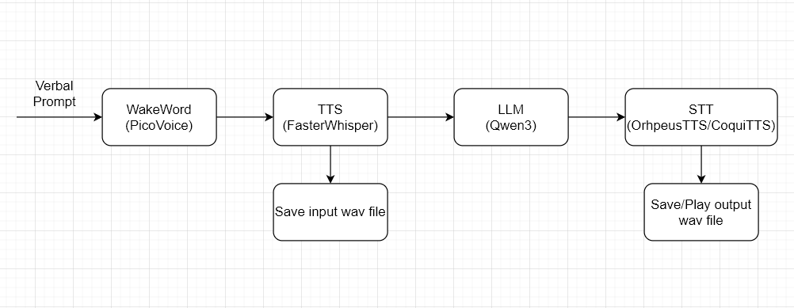

# Speech to Speech Pipeline

 This repo consists of a fully locally hosted AI voice assistant that transcribes speech in real time, processes natural conversations with a local LLM, and responds using realistic text-to-speech.

 There are 4 main components to this pipeline
 - Wake Word: Requires an activation word to start pipeline (e.g. "Hey PicoVoice")
 - STT: Transcribes your voice into text
 - LLM: Returns a responce to your prompt
 - TTS: Synthesizes LLM output to speech




## Table of Contents

- [Speech to Speech Pipeline](#speech-to-speech-pipeline)
  - [Table of Contents](#table-of-contents)
  - [Requirements](#requirements)
  - [Installation - Windows](#installation---windows)
    - [CUDA](#cuda)
      - [Download](#download)
      - [Environmental Variables](#environmental-variables)
    - [CUDNN](#cudnn)
      - [Download](#download-1)
      - [Installation](#installation)
    - [LM Studio](#lm-studio)
    - [Espeak-ng](#espeak-ng)
    - [PicoVoice](#picovoice)
    - [Program Installation](#program-installation)
  - [Installation - Linux](#installation---linux)
    - [CUDA and CUDNN](#cuda-and-cudnn)
    - [LM Studio](#lm-studio-1)
    - [Espeak-ng](#espeak-ng-1)
    - [PicoVoice](#picovoice-1)
    - [Program Installation](#program-installation-1)
  - [Execution](#execution)
    - [Starting LM Studio](#starting-lm-studio)
    - [Creating ENV file](#creating-env-file)
    - [Editing Program Parameters](#editing-program-parameters)
      - [Audio Settings](#audio-settings)
      - [TTS Choice](#tts-choice)
    - [Running Program](#running-program)
  - [Credits](#credits)


## Requirements
- Python 3.12
- CUDA 12.1
- CUDNN 9.11.0
- Espeak-ng (download from https://github.com/espeak-ng/espeak-ng/releases/tag/1.52.0 or `sudo apt-get install espeak-ng`)
- LM Studio (https://lmstudio.ai/)
- PicoVoice Account (https://console.picovoice.ai/)

## Installation - Windows

### CUDA
#### Download
1. Go to the [NVIDIA CUDA Toolkit 12.1 Download Page](https://developer.nvidia.com/cuda-12-1-0-download-archive).
2. Select:
    - Operating System: **Windows**
    - Architecture: **x86_64**
    - Version: **Windows 10 or 11**
    - Installer Type: **EXE (Local)** (recommended)
3. Download and run the installer.
4. In the installer:
    - Express Installation is recommended unless you need a custom path.
    - Accept the license agreements.

This will install Cuda 12.1 in the following path `C:\Program Files\NVIDIA GPU Computing 
Toolkit\CUDA\v12.1`

#### Environmental Variables
1. Now, you need to add the necessary entries to Windows Environmental Variables such that CUDA is detected globally.

2. In Window search, search for `Edit the system environment variables` and press enter.

3. Then click the `Environmental Variables` button on bottom right of the popup window.

4. Under `System Variables` find the `Path` variable and double-click.

5. Create the following new entries:
   - C:\Program Files\NVIDIA GPU Computing Toolkit\CUDA\v12.1\bin\include
   - C:\Program Files\NVIDIA GPU Computing Toolkit\CUDA\v12.1\bin
   - C:\Program Files\NVIDIA GPU Computing Toolkit\CUDA\v12.1\libnvvp
   - C:\Program Files\NVIDIA GPU Computing Toolkit\CUDA\v12.1
   - C:\Program Files\NVIDIA GPU Computing Toolkit\CUDA\v12.1\include
   - C:\Program Files\NVIDIA GPU Computing Toolkit\CUDA\v12.1\lib\x64
   - C:\Program Files\NVIDIA GPU Computing Toolkit\CUDA\v12.1\lib

6. If you have multiple CUDA installations, move these up before the other entries so Cuda 12.1 is used insted.

7. Press ok 

8. Now, create 2 new system variables named `CUDA_HOME` and `CUDA_PATH` and enter `C:\Program Files\NVIDIA GPU Computing Toolkit\CUDA\v12.1`

9. Once installed, verify the installation by opening a terminal and running the following
    ```
    nvcc --version
    ```
10. Should have the following lines or similar
    ```
    Cuda compilation tools, release 12.1, V12.1.66
    Build cuda_12.1.r12.1/compiler.32415258_0
    ```

### CUDNN
#### Download
1. Go to the [NVIDIA CUDNN 9.11.0 Download Page](https://developer.nvidia.com/cudnn-9-11-0-download-archive).
2. Select:
    - Operating System: **Windows**
    - Architecture: **x86_64**
    - Version: **Tarball**
    - CUDA Version: **12**
3. Download the zip
4. Extract the zip

#### Installation
1. Copy the individual files from the CUDNN folder to their respective folders in the CUDA installation path.
    - `<path_to_cudnn_download>\bin\*` -> `C:\Program Files\NVIDIA GPU Computing Toolkit\CUDA\v12.1\bin`
    - `<path_to_cudnn_download>\lib\x64\*` -> `C:\Program Files\NVIDIA GPU Computing Toolkit\CUDA\v12.1\lib\x64`
    - `<path_to_cudnn_download>\include\*` -> `C:\Program Files\NVIDIA GPU Computing Toolkit\CUDA\v12.1\include`

### LM Studio
LM Studio is a inferencing client that helps us downloads and run LLM models without hassle. It also wraps the inferencing call with a Openai API. 

1. Head over to [LM Studio Download Page](https://lmstudio.ai/download) and download the program.

2. Open the program and go through the initial setup.

3. After setup, change LM Studio to Developer mode by clicking on the `Developer` option on bottom left.

4. Access settings (bottom right of window) and under `Hardware` check if you GPU is detected. Then exit the settings window.

5. On the left navigation pane, select the 4th icon (Magnifying glass) to search and download the following models:

    - mradermacher/Josiefied-Qwen3-8B-abliterated-v1-GGUF
    - isaiahbjork/orpheus-3b-0.1-ft-Q4_K_M-GGUF

    > **Note:** Ensure that the `Q4_K_M` version is selected in the dropdown on the right pane above the model readme
    


### Espeak-ng
1. Go to the [Espeak-ng Github Download Page](https://github.com/espeak-ng/espeak-ng/releases/tag/1.52.0).
2. Scroll down and download `espeak-ng.msi`
3. Run the installer
4. Now, we need to add the installation filepath to PATH varaibles (similar to what we did on the CUDA step)
    - Espeak-ng exe can usually be found at `C:\Program Files\eSpeak NG`.
    - Add this filepath to the PATH System Variable similar to CUDA 

### PicoVoice
1. Go to [PicoVoice Website](https://console.picovoice.ai/) to create an account and sign in
2. On home page consol, you will see an Access Key, keep note of it 

### Program Installation
1. Close your terminal (if already open) and launch it. (This allows the new instance to recognize the additions to the PATH variables)

2. Nagivate to the project directory
    ```
    cd <path_to_project>\speech-to-speech
    ```

3. Create a virtual environment using Python 3.12
    ```
    python3 -m venv venv

    or

    py -3.12 -m venv venv
    ```

3. Install requirements
    ```
    scripts\install_req.bat
    ```


## Installation - Linux
### CUDA and CUDNN
### LM Studio
### Espeak-ng
### PicoVoice
1. Go to [PicoVoice Website](https://console.picovoice.ai/) to create an account and sign in
2. On home page consol, you will see an Access Key, keep note of it

### Program Installation

## Execution

### Starting LM Studio
1. Open LM Studio
2. On the left navigation pane, select the 2nd icon (developer section)
3. Near the top left enable the server. Should initially say `Status: Stopped`
4. On the top nav bar, select and load the `Josiefied qwen3 8b abliterated v1` model

### Creating ENV file
1. In the PROJECT directory create a new file named `.env`
2. Add the following variables
   ```
   OPENAI_API=http://127.0.0.1:1234/v1
   OPENAI_API_KEY="lm-studio"
   PICOVOICE_API_KEY=<Paste PicoVoice AccessKey Here>
   ```
### Editing Program Parameters
Parameters can be edited in `config.py`

Important parameters are:
- AUDIO_IN_DEVICE
- AUDIO_OUT_DEVICE
- TTS_CHOICE

#### Audio Settings
1. Run the following script
    ```
    scripts\check_audio_devices.bat

    or

    bash scripts/check_audio_devices.sh
    ```
2. Determine which devices you want to use for input and output
3. Update the parameters respectively

#### TTS Choice
Parameter determines which TTS engine to use.

In terms of speed and less resource usage: "coqui" > "orpheus"

In terms of realism and emotions: "orpheus" > "coqui"

> Note if "orpheus" is selected, you must also load the `orpheus-3b-0.1-ft-Q4_K_M-GGUF` on LM Studio

### Running Program
```
run.bat

or

bash run.sh
```

Note that the first time program is run, it will take longer to initialize since TTS and STT engines need to download their models.

All subsequent runs will take slightly quicker to initialize.

## Credits
- [canopyai/Orpheus-TTS](https://github.com/canopyai/Orpheus-TTS)
- [Deathdadev/Orpheus-Speech-PyPi](https://github.com/Deathdadev/Orpheus-Speech-PyPi)
- [coqui-ai/TTS](https://github.com/coqui-ai/TTS)
- [SYSTRAN/faster-whisper](https://github.com/SYSTRAN/faster-whisper)


